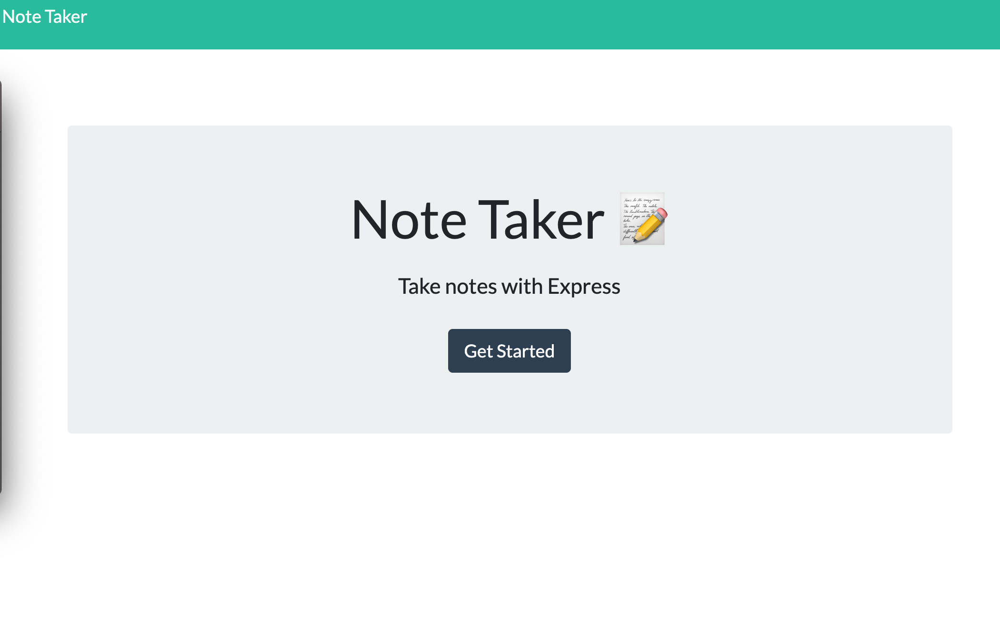
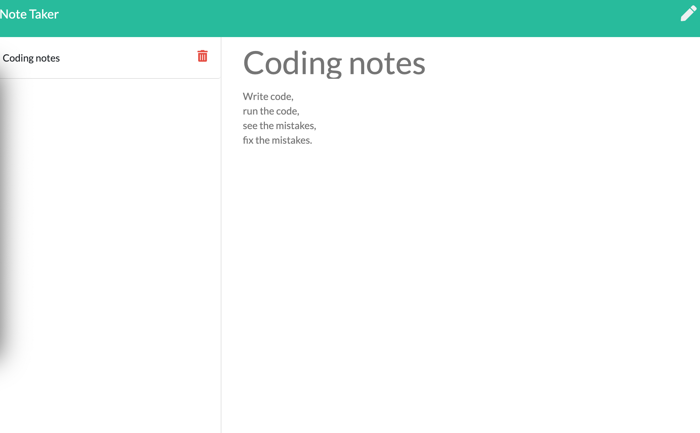

# Note Taker

## Table of Contents
- [Description](#description)
- [Installation](#installation)
- [Questions](#contact)
- [Contact](#contact)

 ## Description:
 
 This simple note taking application allows you to save notes. 
  

 ## Installation:
   NPM Install
   Open [http://localhost:3005](http://localhost:3005) to view it in the browser.

 ## Questions:
   For questions, you can go to my GitHub page at the following Link:

   - [GitHub Profile](https://github.com/DewdropStudio)
   - [Deployed App](https://still-fortress-19881.herokuapp.com)

 ## Contact:
   For additional questions please reach out to my email rocio.avila@northwestern.edu
